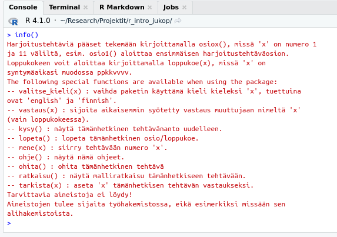

---
output:
  pdf_document: default
  html_document: default
---
# R-kurssi {-}

Täältä löydät suomenkielisen materiaalin, joka tukee UEF:in R-kurssin suorittamista (R-kieli 3622223, 2 op). Jokaisen viikon materiaalit päivitetään tänne. Alla on ohjeet tarvittavien asioiden asentamiseen UEF:in koneille.

Anton Klåvusin vuonna 2020 kirjoittamaa ansiokasta materiaalia on kehitetty lukukauden 2021-22 R-kielen kurssia ajatellen. Materiaalia on täydennetty tarvittavin osin. Samalla materiaali on konvertoitu bookdown-verkkokirjamuotoon.

## Ohjeita verkkokirjan käyttöön {-}

Tämä opiskelumateriaali on luotu bookdown-verkkokirjaohjelman avulla. Kirjaa voi lukea verkkoselaimella ja se toimii myös puhelimella. Sivun ylälaidasta löydät asetuksia, joilla voit tehdä ainakin seuraavia asioita: piilottaa ja näyttää vasemman sivuvalikon, etsiä dokumentista hakusanalla, muuttaa fonttia, muuttaa fontin kokoa ja sivun väritystä sekä ladata monisteen pdf-muodossa.

## Lunttilappu {-}

Tämän materiaalin ohessa kannattaa käyttää apuna nk. Cheat Sheetiä eli "lunttilappua". Lunttilapusta on helppo tarkastaa miten jokin jo oppimasi asia tehdään R:ssä, jos et vielä muista kunnolla kyseistä asiaa. Internetistä löytyy Cheat Sheetejä useisiin [R-paketteihin](https://www.rstudio.com/resources/cheatsheets/) ja muihin kokonaisuuksiin, mutta tässä käytetään Base R Cheat Sheetiä. Lataa Base R Cheat Sheet itsellesi [painamalla tästä](files/base_R_cheat_sheet.pdf). Suosittelen tulostamaan lunttilapun värillisenä kaksipuoleisena. Mikäli mahdollista niin A3-kokoisena tulosteena teksti näkyy parhaiten.

## Verkkolähteitä {-}

Tämä materiaali on tarkoitettu riittäväksi materiaaliksi kurssille. Tässä kuitenkin joitakin verkosta löytyviä lähteitä, joista voi olla apua.

 - [Tutorialspoint](https://www.tutorialspoint.com/r/index.htm) Soveltuu R:n opiskeluun englannin kielellä, jos osaa entuudestaan jo vähän ohjelmoida.

## Sisällysluettelo {-}

- [Johdanto](#intro)
  * [Mikä on R ja mitä sillä tehdään?](#what_R)
  * [Muuttujat ja vektorit](#variables_and_vectors)
  * [Extra: Alkeistietotyypit ja puuttuvat arvot](#extra)
- [Tietotyypit: data frame, matriisi, taulukko ja lista](#data_types)
  * [data frame](#data-frame)
  * [matriisi (matrix)](#matriisi)
  * [Tietotyyppien tarkastelu](tietotyyppien-tarkastelu)
  * [Extra: Taulukko ja lista](#taulukot-ja-listat)
    * [taulukko (array)](#taulukko)
    * [lista (list)](#lista)
- [Datan lukeminen](#reading_data)
- [Aineiston muokkaaminen](#data-wrangling)
  * [Uuden muuttujan tai rivin luonti datakehikkoon](#data-frame-wrangling)
  * [Osajoukkojen valinta](#osajoukkojen-valinta)
  * [Faktorit](#faktorit)
  * Faktor-vektorit (POISTA tai yhdistä!)
- [Tunnusluvut](#statistics)
  * [Sijaintia kuvaavat tunnusluvut](#sijaintia-kuvaavat-tunnusluvut)
  * [summary()](#summary)
  * Varianssi, keskihajonta ja kvantiilit
- [Todennäköisyysjakaumat](#distributions)
- [Kuvaajien piirtäminen](#plotting)
  * [Kuvaajan tallentaminen](#kuvaajan-tallentaminen)
- [Tilastollinen testaaminen](#tests)
  * [Khi toiseen -testi](#chi-squared-test)
  * Kahden otoksen t-testi
  * Varianssianalyysi
- [Lineaariset mallit](#linear_models)
- [Funktiot](#functions)
- [Ehtorakenteet](#ifelse)
- [Toistorakenteet](#loops)


# Alkuvalmistelut {-}

## RStudio {-}

Nykyisin R-kielen kurssilla käytetään ensisijaisesti RStudiota, mutta muutkin ohjelmointiympäristöt toimivat. RStudio on ohjelmointiympäristö eli IDE (Integrated Development Environment), joka tekee koodaamisesta huomattavasti mukavampaa. RStudio on saatavilla useille käyttöjärjestelmielle ja se on ilmainen ohjelma.

## R:n ja RStudion asentaminen omalle tietokoneelle {-}

Mene seuraavalle sivulle, josta asennat ensin R:n (1. vaihe) ja sitten RStudio Desktop omalle käyttöjärjestelmällesi. Ellet tiedä käyttöjärjestelmääsi, on se luultavimmin Windows 10.

https://www.rstudio.com/products/rstudio/download/#download (avautuu uuteen ikkunaan)

## RStudion asennus yliopiston koneelle {-}

Mikäli et halua käyttää omaa tietokonettasi kurssin suoritamiseen, niin RStudion saa asennettua UEF:in koneilla Sofware Centerin kautta. Software Center löytyy Windowsin omalla haulla.


RStudio:n voi asentaa Software Centeristä, ja RStudion pitäisi sen jälkeen olla käytettävissä.


## RStudion käyttö {-}

RStudion näkymässä on neljä osaa:


#### 1. Editori. {-}

Editorilla kirjoitetaan R-koodia sisältäviä tiedostoja, eli R-skriptejä. Uuden skriptin saa auki painamalla File -> New File -> R Script (tai Ctrl + Shift + N). Skripteihin tutustutaan myöhemmin kurssilla, mutta ne ovat yksinkertaisuudessaan kokoelma R-komentoja, jotka yhdessä tekevät jotain, esimerkiksi analysoivat jonkin tutkimusprojektin datan tai piirtävät valmiista tuloksista kuvaajia.

Editoriin kirjoitettua koodia voi ajaa rivi kerrallaan painamalla rivin kohdalla Ctrl + Enter. Useamman rivin voi myös maalata ja suorittaa kerrallaan. Yläreunassa oleva "Source"-nappi ajaa kaiken nykyisen tiedoston koodin.

R-skriptejä voi tallentaa ihan kuin muitakin tiedostoja. R-skpriptien  tiedostopääte on .R

#### 2. Konsoli. {-}

Konsolissa "ajetaan" eli suoritetaan R-komentoja. Jos editoriin kirjoitettua koodia ajetaan, RStudio ajaa komennot automaattisesti konsolissa. Konsolissa pelkkä Enter riittää koodirivin suorittamiseen. Voit kokeilla kirjoittaa konsoliin jonkun laskutoimituksen, kuten ```2 * 3``` ja painaa Enter, jolloin tuloksen pitäisi tulostua konsoliin. Voit myös kokeilla kirjoittaa laskuja editoriin, ja painaa Ctrl + Enter, jolloin pitäisi tapahtua sama asia.

Suurin ero konsolin ja editorin välillä on se, että **konsoliin kirjoitetut komennot eivät tallennu mihinkään tiedostoon**. Jos siis haluat säästää koodisi, se tulee kirjoittaa editoriin ja tallentaa .R-tiedostoon. Saman istunnon aikana tehtyjä komentoja voi konsolissa selata ylös- ja alas-nuolila.

Moodlen ohjeissa ja videoissa käytetään R:ää puhtaasta R-konsolista. Voit siis kuvitella, että kurssin videoissa näkyy vain RStudion tämä osa, ja muut osat ovat vain helpottamassa työtäsi.

#### 3. Työtila {-}

Työtilassa näkyvät R-istunnon aikana luodut muuttujat. Näistä lisää ensimmäisen viikon materiaalissa.

#### 4. Kuvaajat / Paketit / Manuaali {-}

Tässä osassa on monta käytännöllistä välilehteä:

- Plots: tänne ilmestyvät R:llä piirretyt kuvaajat
- Packages: Täältä voi hallita asennettuja paketteja (alla ohjeet tällä kurssilla tarvittavien pakettien asennukseen)
- Help: Täällä voi selata R:n manuaalia, jossa on ohjeet jokaiselle R-komennolla. Voit kokeilla ajaa editorissa tai konsolissa komennon ```?print```, joka avaa ```print```-funktion ohjesivun.


Kun tehtävät tallentaa tähän tyyliin, voi ensi kerralla vain yksinkertaisesti ajaa skriptin haluamaansa tehtävään asti. Samalla koneella ja samalla opiskelijanumerolla pitäisi tulla samat tehtävät.


## Rcourse-paketin asentaminen {-}

### R-paketit {-}

R-ohjelmoinnissa asennetaan usein R-paketteja. Paketit ovat kokonaisuuksia, jotka lisäävät R:ään ominaisuuksia. Esimerkiksi tälle kurssille tarvittava paketti arpoo opiskelijalle tehtäviä kurssin aihepiiristä ja lähettää tiedon osioiden suorituksesta opettajalle.

### Asentaminen {-}

Rcourse-paketti asennetaan suorittamalla seuraava koodi R:ssä. Kopioi koodi joko R-skriptiin ja aja se tai kopioi se suoraan Console-ikkunaan ja paina Enter-näppäintä.
```{r, eval=FALSE}
source(url("http://users.jyu.fi/~santikka/Rcourse/install.R"))
```
Tämän jälkeen paketti tulee ladata käyttöön
```{r, eval=FALSE}
library(Rcourse)
```
Komento ```info()``` tulostaa ohjeet (ensimmäisellä käyttökerralla kieli on englanti). Voit vaihtaa kielen suomeksi näin:
```{r, eval=FALSE}
select_language("finnish")
```
Tarkastele vielä suomenkielisiä komentoja:
```{r, eval=FALSE}
info()
```


Aloita sitten osion 1 harjoitustehtävien suorittaminen komennolla
```{r, eval=FALSE}
osio1()
```
Kun olet suorittanut harjoitusosion 1, voit jatkaa seuraavaan osioon. Osiot 1-8 ovat pakollisia (tentit kysyvät näiden osioiden sisältöjä) ja osiot 9-11 ovat lisämateriaalia kiinnostuneille (ei kysytä tentissä).


### Opiskelu ja tenttiminen Rcourse-paketin avulla {-}

Kurssin harjoitustehtävät suoritetaan käyttäen Rcourse-pakettia, eli 1. osion voi aloittaa komennolla
```{r, eval=FALSE}
osio1()
```
Lisäksi tenttimien onnistuu vastaavasti funktiolla loppukoe(x), mutta tällöin merkin x tilalle on annettava oma syntymäaika muodossa dddmmyyyy. Esim. henkilö joka on syntynyt 1. tammikuuta 1990 antaisi
```{r, eval=FALSE}
loppukoe(01011990)
```

### Tehtävien tallentaminen skripteihin RStudiolla {-}

Suurin osa kurssin tehtävistä on melko lyhyitä, joten ne voi tarvittaessa tehdä suoraan konsoliin. Suosittelen kuitenkin kirjoittamaan varsinkin pidemmät ja monimutkaisemmat tehtävät muistiin editoriin. Suosittelenkin tekemään jokaista osiota varten erillisen R-skriptin, joka sisältää itse tehtävien tarvitseman koodin sekä palautuskomennot. Tällainen skripti näyttää jotakuinkin tältä:

```{r, eval=FALSE}
# Teht 1
vast <- 1
tarkista(vast)

# Teht 2
vast <- c(1, 2, 3)
tarkista(vast)

# Teht 3
vast <- "jotain"
tarkista(vast)
```

Mikäli käytät nimen ```vast``` sijasta jotain muuta nimeä, niin sinun on käytettävä samaa nimä myös tarkista-funktion argumenttina!
