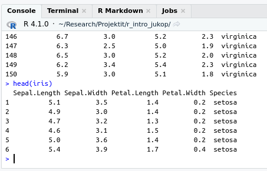

# Tietotyypit {#data_types}

Tässä osassa tutustutaan neljään uuteen tietorakenteeseen:

- [datakehikko (data.frame)](#data-frame)
- [matriisi (matrix)](#matrix)
- [taulukko (array)](#array)
- [lista (list)](#list)

Datakehikko on R:n objekti, jossa voidaan säilyttää aineistoa. Muuttujat ovat kehikon sarakkeita ja muuttujilla tulee aina olla nimi.

Matriisi voi olla joillekin tuttu käsite myös tilastotieteen tai matematiikan kursseilta, ja R:n matriisi vastaakin matemaattista matriisia. Tästä syystä matriisi on hyvin yleinen tietorakenne, johon ei voi olla törmäämättä jos käyttää R:ää tutkimuksessa. Matriisilla tehdään yleensä kuitenkin matemaattisia operaatioita, eikä se ensisijaisesti ole aineiston säilytyspaikka.

Taulukko on juuri sitä miltä se kuulostaa: vektorintapainen tietorakenne, johon tallennetaan alkioita (elements), joilla on kaikilla sama luokka (class), eli esimerkiksi lukuja. Ero vektoriin on se, että taulukolla on useampi ulottuvuus. Matriisi on erikoistapaus taulukosta, sillä matriisi on kaksiulotteinen taulukko. Matriisi vastaa siis oikeastaan paremmin sitä mielikuvaa, joka monelle tulee mieleen suomen kielen sanasta taulukko, ja matriisit ovatkin paljon yleisempiä kuin moniulotteiset taulukot.

Lista on järjestetty kokoelma alkioita, jotka voivat olla eri tyyppisiä objekteja.

Koska datakehikko on kaikista tärkein ja eniten käytetty tietotyyppi, niin aloitetaan siitä.

## Datakehikko (data.frame) {#data-frame}

Datakehikko on erittäin yleinen tietorakenne tiedon tallentamiseen R:ssä. Datakehikko on kaksiulotteinen tietorakenne, eli sillä on rivejä ja sarakkeita. Datakehikon sarakkeet muodostuvat vektoreista. Sarakevektorit voivat olla eri luokan vektoreita, mutta datakehikko asettaa lisärajoitteen: vektoreiden on oltava yhtä pitkiä. Yhden rivin sarakkeilla olevien arvojen ajatellaan koskevan yhtä havaintoa.

Luodaan datakehikko, jossa on kaksi muuttujaa, `height` ja `weight`, ja sijoitetaan niihin kahdeksan mittauksen tiedot. Huomionarvoista on se, että komennon `data.frame` sulkujen sisällä on käytettävä yhtäsuuruusmerkkiä (=) eikä sijoitusoperaattoria (<-). Tämä johtuu siitä, että teknisesti ottaen komento `data.frame` on funktio (funktioista lisää myöhemmin).

```{r}
study_data <- data.frame(
    ID = 1:8,
    height = c(189.8, 184.0, 173.8, 175.9, 169.0, 183.7, 181.8, 16.9),
    gender = c("male", "female", "male", "male", "female", "male", "male", "female")
)
study_data
```
Huomaa, että jos sarakkeita ei itse nimeä, niin `data.frame` nimeää ne automaattisesti, mutta näin luodut nimet eivät välttämättä ole ollenkaan kuvaavia.
```{r}
no_names_data <- data.frame(
    1:8,
    c(189.8, 184.0, 173.8, 175.9, 169.0, 183.7, 181.8, 16.9),
    c("male", "female", "male", "male", "female", "male", "male", "female")
)
no_names_data
```
Datakehikkojen käsittelystä kerrotaan tarkemmin luvussa [Datan muokkaaminen](#data-frame-wrangling).


## Matriisi {#matrix}

### Matriisin luominen

Matriisin luominen on yksinkertaista ja se tapahtuu funktiolla `matrix`.

```{r}
matrix(1:9, nrow = 3, ncol = 3)
```

Funktiolle annetaan siis matriisiin tallennettavat luvut vektorina, sekä matriisin rivien ja sarakkeiden määrä (argumentit `ncol` ja `nrow`). Matriisi voi koostua myös kokonaan tietystä arvosta:

```{r}
matrix(0, nrow = 2, ncol = 5)
```

Jos matriisin tallennettavat luvut annetaan vektorina, niin tällöin riittää antaa vain joko rivien tai sarakkein lukumäärä, ja R osaa päätellä puuttuvan dimension annetun vektorin perusteella.

```{r}
matrix(1:9, nrow = 3)
```

Useimmiten matriisien data luetaan R:ään jostain tiedostosta, joka on tuotettu Excelillä tai jollain muulla ohjelmalla (tutkimustulosten kirjaus suoraan R:ään on raskasta). Matriisien luonti käsin on kuitenkin hyvä osata, sillä pienillä matriiseilla on kätevää testata omaa koodia. Myös yllä olevan kaltaisia, esim. nollalla täytettyjä matriiseja on joskus kätevää käyttää "alustana", kun lasketaan omasta datasta tuloksia rivi tai sarake kerrallaan. Tämä johtuu siitä, että olemassa olevan matriisin rivin arvojen muuttaminen on nopeampi operaatio kuin rivin lisääminen matriisiin.

### Matriisin koko

Joskus voi törmätä matriiseihin, joiden kokoa ei tiedetä, tai ei haluta olettaa. Tällöin tarvitaan funktioita, jotka kertovat matriisin koosta. Esimerkiksi, kun luetaan dataa R:ään tiedostoista, on hyvä tarkistaa, että kaikki rivit ja sarakkeet ovat mukana. Funktiot `nrow` ja `ncol` palauttavat rivien ja sarakkeiden määrän, `dim` palauttaa matriisin rivien ja sarakkeiden määrän vektorina, jossa rivien määrä on ensimmäinen alkio.

```{r}
X <- matrix(1:12, ncol = 4)
# Number of rows
nrow(X)
# Number of columns
ncol(X)
# Dimensions
dim(X)
```

### Matriisin indeksointi

Matriisin indeksointi on hyvin samantapainen operaatio kuin vektorin indeksointi, eli matriisin perään laitetaan hakasulkeet ja niihin määritellään halutut indeksit. Matriisin indeksoinnissa pitää kuitenkin antaa erikseen indeksit riveille ja sarakkeille, pilkulla erotettuna. Jos hakasulkeisiin antaa vain yhden luvun ilman pilkkua, niin R käsittelee matriisia vektorina, jolloin indeksointi tapahtuu kuten vektoreiden tapauksessa.

```{r}
# Only nrow is enough, since the number of columns must be 3
X <- matrix(1:9, nrow = 3)
X
# Element on second row, third column
X[2, 3]

# The complete first row
X[1, ]

# The second and third values of the second column
X[2:3, 3]

# Get rows where the values of the first column are > 1
X[X[, 1] > 1, ]
```

HUOM: jos matriisia indeksoidessa tuloksessa sarakkeiden tai rivien määrä on tasan yksi, kuten yllä olevissa esimerkeissä viimeistä lukuun ottamatta, tuloksena on vektori, ei matriisi. Jos haluaa tuloksen olevan matriisi, tulee hakasulkeisiin lisätä argumentti `drop = FALSE`

```{r}
# The complete first row
X[1, , drop = FALSE]
# The second and third values of the second column
X[2:3, 3, drop = FALSE]
```

Matriiseja voi myös muokata sijoittamalla haluttuihin paikkoihin uusia arvoja:

```{r}
# Copy of X
X_new <- X
# Replace first row with new values
X_new[1, ] <- c(10, 13, 15)
X_new
# Replacement can also be a single value, and will be recycled
X_new[2:3, 1] <- 0
X_new
```

Rivejä tai sarakkeita voi myös poistaa. Tämä tapahtuu antamalla indeksi miinusmerkkisenä:

```{r}
# Without first row
X[-1, ]
# Without second column
X[, -2]
```

Huomaa kuitenkin, että positiivisia ja negatiivisia indeksejä ei voi käyttää samanaikaisesti tietyssä dimensiossa:

```{r, error = TRUE}
# Trying to mix positive and negative indices
X[c(-1, 1), ]
```

#### Indeksimatriisi (index matrix)

Jos halutaan poimia useampi yksittäinen arvo matriisista, tulee käyttää indeksimatriisia (index matrix).

Esimerkiksi, jos haluttaisiin poimia äskeisestä matriisista `x` arvot indekseissä [1, 2], [1, 3] ja [2, 2], niin seuraava koodi ei toimi:

```{r}
X[c(1, 1, 2), c(2, 3, 2)]
```

vaan tulee käyttää indeksimatriisia, jonka jokainen rivi antaa yhden halutun alkion rivi- ja sarakeindeksin tässä järjestyksessä. Indeksimatriiseja tehdessä kannattaa asettaa argumentti `byrow = TRUE`, jolloin alkiot laitetaan matriisiin rivi kerrallaan, ei sarake kerrallaan kuten oletusarvoisesti tehtäisiin.

```{r}
i <- matrix(c(1, 2, 1, 3, 2, 2), nrow = 3, byrow = TRUE)
i
X[i]
```

### Matriisien rakentaminen vektoreista

Matriisi koostuu usein useammasta muuttujasta ja havainnoista. Yleensä jokainen rivi vastaa yhtä havaintoa, ja sarake muuttujaa. Tämän takia on hyvä tietää, miten yksittäisistä vektoreista saa koottua matriiseja. Alla olevassa esimerkissä on koottu yhteen matriisiin Star Wars -hahmojen pituuksia ja painoja. Tämä tapahtuu `cbind` funktiolla (column bind), joka nimensä mukaisesti yhdistää vektorit matriisin sarakkeiksi. `cbind` voi yhdistää myös valmiita matriiseja yhteen, niin että matriisit ovat "vierekkäin" eli yhdistetyssä matriisissa on kummankin matriisin sarakkeet (rivien määrän tulee olla sama). Vastaavasti `rbind` (row bind) yhdistää matriiseja "allekkain" (sarakkeiden määrän tulee olla sama).

```{r}
heights <- c(172, 167, 96, 202, 150, 178)
masses <- c(77, 75, 32, 136, 49, 120)

starwars <- cbind(heights, masses)
starwars
```

### Rivien ja sarakkeiden nimeäminen

Matriisien rivit ja sarakkeet voi nimetä, ja usein tässä onkin järkeä. Yllä olevassa esimerkissä `starwars`-matriisin sarakkeet on nimetty alkuperäisten vektorien mukaan. Alla olevassa esimerkissä on lisää tapoja nimetä rivejä ja sarakkeita

```{r}
# Set column names by naming arguments while building matrix from vectors
cbind(Height = heights, Mass = masses)

# Set column and row names explicitly
colnames(starwars) <- c("Height", "Mass")
rownames(starwars) <- c("Luke Skywalker", "C-3PO", "R2-D2", "Darth Vader", "Leia Organa", "Owen Lars")
starwars
```

Nimettyjä matriiseja voi indeksoida myös nimien perusteella:

```{r}
starwars[c("Luke Skywalker", "R2-D2"), ]
```

Matriisiin voi myös lisätä uusia sarakkeita `cbind` funktiolla. Alla lisätään matriisiin starwars uusi sarake, jossa on hahmojen BMI:

```{r}
# Create a vector for BMI and add to matrix with cbind
bmi <- starwars[, "Mass"] / (starwars[, "Height"] / 100)^2
cbind(starwars, "BMI" = bmi)
```


### Matriiseilla laskeminen

Matriiseilla laskeminen on hyvin samankaltaista kuin vektoreilla laskeminen. Matriisin ja yksittäisen luvun välisessä operaatiossa matriisin alkiot käsitellään yksitellen. Samoin samankokoiset matriisit voi esim. lisätä yhteen, jolloin lisäys tapahtuu alkio kerrallaan.

```{r}
X <- matrix(1:9, nrow = 3)
Y <- matrix(3:11, nrow = 3, ncol = 3)
# Element-wise multiplication
X * 2
# Element-wise sum
X + Y
```
<!-- Santtu: Oppikirja? -->
Matriiseille on lisäksi määritelty paljon matriisien omia laskutoimituksia, niistä voi lukea lisää oppikirjasta. Matriisilaskentaa opiskelleille huomio: R:ssä oletuksena kertolasku tehdään alkioittain, matriisitulo tapahtuu operaattorilla `%*%` ja matriisin transpoosin voi määrittää funktiolla `t`.

## Tietotyyppien tarkastelu {#data-type-view}

Kaikkia objekteja voi tulostaa Console-ikkunassa kutsumalla objektin nimen. Joskus tarvitaan kuitenkin apufunktioita.

### View()

Mikäli käytät RStudiota, niin tarkempaa tarkastelua varten kannattaa kuitenkin käyttää `View`-funktiota. `View` avaa ikkunan, jossa voi selata data framen tai matriisin rivejä ja sarakkeita, sekä järjestää arvoja halutun sarakkeen mukaan (tämä järjestys säilyy vain `View`-näkymässä, itse muuttujan rakenne ei muutu). Mikäli aineistossasi on satoja tuhansia tai miljoonia rivejä, niin `View` saattaa olla liian hidas.

### str()

Perineinen tapa tarkastella objekteja R:ssä on funktio `str`, joka toimii kaikissa R-ympäristöissä. str tulostaa tiivistetyssä muodossa kaiken, mitä sille annettu objekti sisältää. Esimerkiksi datakehikon tapauksessa sen avulla saadaan sekä muuttujien nimet, niitä vastaavien vektoreiden tyypit että ruudulle mahtuvan osan vektoreiden alkioista.

```{r}
# Examine the structure of data frame
str(study_data)
```

### head()

Jos aineistossa on todella paljon rivejä, on sen tulostaminen Console-ikkunaan ikävää. Ladataan esimerkiksi `iris`-data, jossa on 150 havaintoa. Tulostettaessa rivejä on niin monta, että muuttujien nimet eivät näy, mikä on epämiellyttävää. Parempi tapa saada käsitys aineistosta on kutsua sitä `head`-funktion avulla.

```{r, eval=FALSE}
# Load data for this example
data(iris)

# Try to print iris-data directly
iris
```


```{r, eval=FALSE}
# Print 6 first rows of iris data
head(iris)
```



```{r, eval=FALSE}
# You can also define the number of rows to print
head(iris,2)
```


## Extra: Taulukko ja lista

Taulukoita ja listoja ei perus data-analyysiä toteutettaessa yleensä tarvita. Lue kuitenkin seuraava, jotta saat yleiskäsityksen mihin niitä tarvitaan. Voit myös palata perehtymään taulukoihin ja listoihin myöhemmin koska tahansa.

### Taulukko {#array}

Kuten alussa todettiin, taulukot (array) ovat hyvin harvinaisia, joten niihin ei kannata tällä kurssilla keskittyä. Niitä kuitenkin tarvitaan joidenkin tehtävien tekemiseen, joten tässä on hyvin lyhyt oppimäärä taulukoista.

Taulukot ovat matriisien kaltaisia, mutta taulukossa voi olla yli kaksi ulottuvuutta. Oikeastaan matriisit ovat kaksiulotteisia taulukoita. Alla on esimerkki 3-ulotteisesta taulukosta, jota voi ajatella "peräkkäin" olevina matriiseina. Alla on kuva 1-ulotteisesta taulukosta eli vektorista, 2-ulotteisesta taulukosta eli matriisista ja 3-ulotteisesta taulukosta.


Taulukkoja luodaan matriisien tapaan funktiolla `array`. Toisin kuin matriisien tapauksessa, `array`-funktiolle pitää luetella sen kaikki ulottuvuudet vektorina. Alla oleva esimerkki luo 3-ulotteisen taulukon, jonka voi ajatella koostuvan kolmesta 4 x 2 matriisista.

```{r}
my_array <- array(1:24, dim = c(4, 2, 3))
my_array
```

<!-- Santtu: Tämä ei tarkkaan ottaen pidä paikkansa, voit kokeilla esim edellisellä my_array[10] toimii aivan hyvin. -->
Taulukoita indeksoidaan aivan kuten matriiseja, mutta jokaiselle ulottuvuudelle on annettava oma indeksi:

```{r}
# The first 2 rows of each "layer"
my_array[1:2, , ]


# Second column from last two layers
my_array[, 2, 2:3]
```

### Lista {#list}

Listat ovat tärkeitä erityisesti silloin, kun aletaan toteuttamaan uusia toimintoja R-kieleen omien funktioiden avulla. Niin kauan kun valmiit R-funktiot riittävät, ei listoilla ole juuri käyttöä. 

Lista (list) on vektorinkaltainen tietorakenne, jossa on järjestyksessä alkioita, jotka on mahdollisesti nimetty. Tärkeä ero vektoriin verrattuna on, että listan alkiot voivat olla erityyppisiä. Listoja luodaan `list`-funktiolla:

```{r}
example_list <- list(c(1, 2, 3),
                     matrix(0, nrow = 3, ncol = 4),
                     "list can include anything")
example_list

subject_ids <- c("ANKL", "PEPA", "DIPR")
measurements <- matrix(c(1, 2.5, 3,
                         3.5, 5, 3,
                         2.3, 3, 1.6),
                       nrow = 3)
colnames(measurements) <- c("CRP", "HDL", "LDL")
rownames(measurements) <- subject_ids
# List names can be given with or without quotes
study <- list(Subject_ID = subject_ids,
              "Measurements" = measurements,
              Study_name = "Blood tests")
study
```

Listoja ja niiden kaltaisia olioita käytetään R:ssä paljon. Listoihin on kätevä tallentaa erityyppistä tietoa, joka kuitenkin halutaan säilyttää yhtenä kokonaisuutena. Esimerkiksi yksinkertaisetkin tilastolliset mallit tuottavat paljon erilaista tietoa, joka tallennetaan listaan (tarkemmin listan kaltaiseen olioon, tästä lisää myöhemmin).

#### Listojen alkioiden käsittely

Listan alkioihin pääsee käsiksi kahdella eri tavalla: kaksoishakasulkeilla `[[]]` tai, jos lista on nimetty, dollarimerkillä `$`:

```{r}
# By position
study[[2]]
# By name
study[["Subject_ID"]]
# Using dollar sign
study$Study_name
```

Listaa voi indeksoida myös yksinkertaisilla hakasulkeilla. Tällöin palautetaan aina lista, eikä yksittäistä alkiota kuten aiemmin. Palautetaan ensiksi mieleen funktio `class`, joka palauttaa argumenttinsa luokan (class). Vektorin luokka vaihtelee vektorin sisällön mukaan: numeric = lukuja, character = merkkijonoja, logical = loogisia arvoja, jne. Listojen luokka on luonnollisesti list. R:ssä kaikki muuttujiin tallennettavat tiedot ovat olioita (object). R-olioilla on aina luokka, joka määrittää sen ominaisuudet. Esimerkiksi `print` ja `plot`-komennot toimivat eri tavalla riippuen niiden argumentin luokasta.

Tarkastellaan alla, mikä ero yksinkertaisilla ja kaksinkertaisilla hakasulkeilla on listan indeksoinnissa:

```{r}
# Returns a list of length one with the matrix as the only element
study[2]
class(study[2])
# Returns the actual matrix
study[[2]]
class(study[[2]])
# Dollar sign also returns the matrix
class(study$Measurements)
# Single brackets works as subscripting just like with vectors
study[2:3]
```

#### Alkion lisäys listaan ja listojen yhdistäminen

Yksittäisen alkion voi lisätä listaan sijoittamalla listan johonkin indeksiin tai nimeen uusi arvo (indeksin pitää olla yhtä suurempi kuin listan pituus). HUOM! Listan alkio voi myös itse olla lista (sisäkkäinen lista = nested list).

```{r}
# Add a character matrix as the fourth element of study
study[[4]] <- matrix(c("CPR", "HDL", "LDL",
                       "C-reactive protein", "High-density lipoprotein",
                       "Low-density lipoprotein"),
                     ncol = 2)
# An element of a list can also be a list
study[["professional"]] <- list(name = c("John H. Watson"),
                                position = "Medical doctor",
                                age = 45)
study
# Note that the fourth element has no name
names(study)
```

Listoja voi yhdistää vektorien tapaan `c`-funktiolla:

```{r}
# Concatenate two vectors
vector1 <- c(3, 6, 5)
vector2 <- c(1, 2, 3)
c(vector1, vector2)


list1 <- list(vector = vector1,
              name = "list1")
list2 <- study[1:2]
# Concatenate three lists, names stay the same
c(list1, list2, list(first_element = "A", second = "B"))
```
