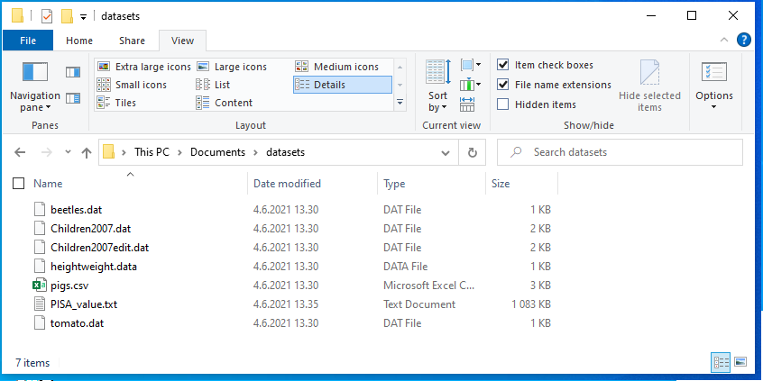

# Datan lukeminen {#reading_data}

Tässä osiossa tutustutaan datan sisään lukemiseen ja sisäänluetun datan tarkistamiseen. Tähän mennessä kaikki kurssilla käsitelty data on luotu R:ssä. Useimmiten R:llä käsiteltävä data on kuitenkin tallennettu tiedostoon, joka on luotu jollain ohjelmalla tai kirjattu esim. Excelissä.

Tässä esitellyt funktiot lukevat erilaisia tiedostoja, mutta kaikki palauttavat datakehikon. Datakehikko sopii aineiston käsittelyyn hyvin, sillä siihen voi tallentaa niin numeerisia kuin tekstimuotoisia muuttujia. Voit tarvittessa kerrata datakehikon toimintaa [datakehikko](#data-frame)-kappaleesta.

Lopussa käydään myös läpi tapoja lukea taulukkolaskenta- (Excel), SPSS- ja SAS-tiedostoja. Näitä tiedostoja ei käsitellä kurssin tehtävissä, mutta on hyvä tietää, että niitä voi lukea R:ään suoraan muuttamatta niitä ensin johonkin toiseen muotoon.

## Hakemistopolut ja tiedostopäätteet

### Hakemistopolut

Jotta aineiston lataus tiedostosta onnistuu, tulee käyttäjän olla tietoinen siitä, missä hakemistopolussa eli kansiossa R työskentelee lataushetkellä. R:llä on siis koko ajan jokin hakemistopolku, johon se viittaa. R:n käyttämän hakemistopolun saat selville komennolla `getwd()`.

```{r, eval=FALSE}
getwd()
```
```
[1] "C:/Users/jukop/Documents"
```
Minulla näyttäisi siltä, että R on oletuksena hakemistossa C:/Users/jukop/Documents. Jos olen purkanut kurssilla tarvittavan datasets.zip -tiedoston aineistot kansioon `C:/Users/jukop/Documents/datasets`, niin minun kannattaa vaihtaa R käyttämään kyseistä hakemistoa. Se tapahtuu näin:

```{r, eval=FALSE}
setwd("C:/Users/jukop/Documents/datasets")
```
`setwd` ei tulosta mitään, jos kansion vaihtaminen onnistuu. Voit vielä `getwd()`-komennolla uudelleen tarkastaa, että hakemisto todella vaihtui.
***Vinkki!*** Ellet tiedä mikä on tarkka hakemistopolku, johon olet purkanut tiedostot, niin se onnistuu klikkaamalla Windowsissa tiedostoselaimen osoiteriviä. Voit kopioida hakemistopolun siitä, mutta vaihda kuitenkin kenoviivat (`\`) kauttaviivoiksi (`/`). Kenoviivoilla on R:ssä erityismerkitys merkkijonoissa, joten ne eivät kelpaa sellaisenaan. Kaksinkertainen kenoviiva (`\\`) toimisi myös.


### Tiedostopäätteet

Windows ei oletuksena nykyisin näytä tiedostopäätteitä. Ne kannattaakin asettaa näkymään tiedostoselaimen avulla. Kyseinen asetus löytyy tiedostoselaimen View-välilehdeltä kohdasta Show/Hide valinta File extensions. Merkitse kyseinen kohta valituksi, jolloin näet tiedostopäätteet, kuten kuvassa. Nyt on helppoa käsittää, kun opettaja puhuu CSV-tiedostoista, että niiden tiedostopääte on .csv.


## Tekstitiedostot

Tekstitiedosto tarkoittaa tässä tapauksessa tiedostoa, joka ei sisällä tekstin lisäksi mitään muuta, kuten erilaisia muotoilutietoja. Tekstitiedostojen yleisimmät tiedostopäätteet ovat .txt ja .csv (comma separated value). Esim. Excelin .xlsx-tiedostot tai Wordin .docx-tiedostot eivät ole tekstitiedostoja, koska niissä on paljon muutakin tietoa tekstin lisäksi.

### read.table

Kun dataa tallennetaan tekstitiedostoon, tiedoston ensimmäisellä rivillä ovat usein sarakkeiden nimet, ja seuraavilla riveillä mahdollisesti rivin nimi, ja sitten sarakkeiden arvot. Jokaisen kentän tulee olla erotettu samalla merkillä (field separator character). Yleisiä erotinmerkkejä ovat sarkain eli tab, välilyönti ja pilkku. Alla olevassa esimerkissä on neljältä kuvitteelliselta koehenkilöltä mitattu puna-vihervärisokeuteen liitettyjen geenien OPN1LW ja OPN1MW ilmentymistasot (lukuarvot ovat allekirjoittaneen hihasta). Tässä eri arvot on erotettu sarkaimella.

```
Subject_ID	OPN1LW	OPN1MW
ANKL	11264	12365
DIPR	10636	12725
PEPA	5630	13248
BRWA	8294	13060
```

Tämä data löytyy myös oheisesta tiedostosta `gene_data.txt`. Tekstitiedostot voi lukea sisään funktiolla `read.table`, jolla on tiedoston polun (file path) lisäksi monta muutakin argumenttia, joista tärkeimmät ovat:

- `header`: looginen arvo (TRUE/FALSE), jolla kerrotaan funktiolle, onko ensimmäisellä rivillä sarakkeiden nimet vai ei
- `sep`: erotinmerkki, jolla muuttujien arvot on eroteltu
- `dec`: desimaalierotin eli desimaalilukujen merkki, jolla desimaalit on eroteltu. Tämä on tärkeä lähinnä suomalaisille, koska Suomessa desimaalierotin on jostain syystä pilkku, eikä piste kuten useimmissa muissa maissa.

Luetaan edellisen esimerkin data R:ään data frameksi:

```{r}
gene_data <- read.table("gene_data.txt", header = TRUE)
gene_data
```

Yllä olevassa esimerkissä ei määritelty erikseen erotinmerkkiä, jolloin erotinmerkiksi tulkitaan kaikki tyhjä tila (white space) eli välilyönnit, sarkaimet jne. Halutessaan erotinmerkin voi myös asettaa. Jos erotinmerkki on sarkain, tulee asettaa `sep = "\t"`

```{r}
gene_data <- read.table("gene_data.txt", sep = "\t", header = TRUE)
gene_data
```

Kuten yllä huomattiin, sarkain erotinmerkkinä merkataan `"\t"`, eikä lainausmerkeillä, joiden sisään laitettaisiin tyhjää tilaa sarkainnäppäimellä. Tämä on yksi esimerkki koodinvaihtomerkin (escape character) `\` käytöstä. R:ssä ja ohjelmointikielissä ylipäätään kenoviiva toimii koodinvaihtomerkkinä, eli sitä ei käsitellä kuin muita merkkejä, vaan se muuttaa seuraavan merkin toimintaa. Usein tämä tarkoittaa sitä, että kenoviivan avulla merkataan sarkainta, rivinvaihtoa (newline, `\n`) ja muita erikoismerkkejä. Koodinvaihtomerkin käyttöä ei tarvitse osata tämän enempää, mutta se esitellään tässä, koska se aiheuttaa ongelmia Windowsin käyttäjille.

Windowsin tiedostopoluissa kansioiden välissä on kenoviiva, kun taas Mac- ja Linux-järjestelmissä käytetään kauttaviivaa `/`. Koska R:ssä kenoviiva on koodinvaihtomerkki, niin helpoin tapa on käyttää tiedostopoluissa Macin ja Linuxien tyyliä. Jos taas halutaan lukea tiedosto R:ään käyttäen Windowsin tapaisia tiedostopolkuja, kenoviivat `\` pitää kirjoittaa kahteen kertaan eli `\\`, jotta R tulkitsee polun oikein. Tällöin ensimmäinen kenoviiva kertoo, että toinen kenoviiva on aito kenoviiva, eikä koodinvaihtomerkki.

Luetaan seuraavaksi sisään data-hakemistossa oleva tiedosto tooth_growth.csv, joka sisältää dataa tutkimuksesta c-vitamiinin vaikutuksesta hampaiden kasvuun marsuilla. .csv-tiedostopääte tulee sanoista comma separated value, eli tiedostossa arvot ovat eroteltu pilkulla. Asetetaan siis sep-argumentiksi ",". Tämä tiedosto sisältää myös rivien nimet ensimmäisessä sarakkeessa. Tämä voidaan kertoa ` read.table`-funktiolle argumentilla row.names, jonka arvoksi voi asettaa sarakkeen numeron, josta rivien nimet napataan.

```{r}
tooth <- read.table("data/tooth_growth.csv", header = TRUE, sep = ",", row.names = 1)
tooth
```

Tutkimuksessa marsuille annettiin C-vitamiinia eri annoksina (dose, mitattu milligrammoina), joko appelsiinimehussa (OJ) tai askorbiinihappona (VC), ja mitattiin odontoblastien (hammasluun emosolu) pituus (len).

### read.csv

.csv-tiedostot ovat niin yleisiä, että niiden lukemiseen on oma funktio: `read.csv`, joka on käytännössä sama funktio kuin `read.table`, mutta parametrien oletusarvot ovat erilaiset, niin että `read.csv(file)` ~ `read.table(file, header = TRUE, sep = ","))`. 

```{r}
tooth <- read.csv("data/tooth_growth.csv", row.names = 1)
tooth
```

#### read.csv2

HUOM: Koska Suomessa pilkkua käytetään desimaalierottimena, kenttien rajaaminen pilkulla ei toimi. Käytännössä tämä näkyy siten, että suomenkielinen Excel tallentaa .csv-tiedosto oletuksena muodossa, jossa desimaalierottimena on pilkku ja kenttien välissä puolipilkku ";". Jos siis olet tallentanut Excelistä taulukon .csv-muotoon ja sen lukeminen R:ään aiheuttaa hankaluuksia, kyse on todennäköisesti erotinmerkistä. Onneksi R:ssä on valmiina funktio `read.csv2`, joka osaa lukea puolipilkulliset .csv-tiedostot oikein.

## Datakehikon tarkastelu

Kun data on luettu sisään R:ään, kannattaa aina tarkistaa, että kaikki data on luettu oikein. Tässä muutama vinkki datakehikon tutkimiseen, joista osaa käsiteltiin jo [datakehikko](#data-frame)-kappaleessa:

`dim` antaa data framen dimensiot, eli rivien ja sarakkeiden määrän.  
`View` avaa data framen erilliseen ikkunaan, jossa sitä voi tarkastella. Suositellaan vain pienemmille data frameille <!-- Santtu: mielestäni view pitäisi jättää mainitsematta -->
`str` kertoo rivien ja sarakkeiden määrät sekä kaikkien sarakkeiden luokat. Kätevä tapa tarkistaa mm. että lukuja sisältävät sarakkeet eivät ole vahingossa muuttuneet merkkijonoiksi.
`table` on kätevä kategoristen sarakkeiden tutkimiseen. Se kertoo, kuinka monta havaintoa muuttujan arvoilla on. `table` voi ottaa vastaan myös kaksi kategorista muuttujaa, ja laskee jokaiselle muuttujien arvojen yhdistelmälle havaintojen lukumäärän. <!-- Santtu: ristiintaulukko? pitäisikö mainita. -->

Katsotaan, mitä `str` kertoo juuri lukemastamme tooth-datasta.

```{r}
str(tooth)
```

Kuten näimme aiemmin, mukana on 10 havaintoa ja 3 muuttujaa. len ja dose ovat luokkaa numeric eli desimaalilukuja, ja supp on luokkaa factor. Factor-tietotyyppiä käsitellään enemmän lineaaristen mallien yhteydessä, mutta sillä merkitään usein kategorisia muuttujia. 

Lasketaan seuraavaksi, kuinka monelle marsulle annettiin appelsiinimehua ja kuinka monelle askorbiinihappoa. 

```{r}
table(tooth$supp)
```

Kumpaakin annostelutapaa käytettiin siis viisi kertaa. Voimme myös selvittää, miten eri annokset jakautuvat annostelutavan suhteen:

```{r}
table(tooth$supp, tooth$dose)
```

Appelsiinimehuna annettiin siis 0.5 mg ja 1 mg annoksia kumpaakin 1 kappale, ja 2 mg annoksia 3 kappaletta.

### R:n sisäänrakennetut datasetit

R:ssä on monta sisäänrakennettua (built-in) datasettiä. Näitä on kätevää käyttää nopeaan testaamiseen, ja ne vilahtelevatkin usein R-oppaissa. Esimerkiksi aikaisempi odontoblastien pituuksia sisältävä datasettimme on oikeastaan pieni otos R:n sisäisestä datasetistä ToothGrowth.

R:n sisäiset datasetit ovat koko ajan käytettävissä, vaikka ne eivät näy RStudion ympäristössä (Environment). Voimme esimerkiksi katsoa, millainen rakenne kokonaisella ToothGroth-datasetillä on:

```{r}
str(ToothGrowth)
```

R:n datasettejä voi käyttää moneen eri tarkoitukseen, kuten datan visualisoinnin tai tilastollisten toimenpiteiden testaamiseen. Listan kaikista R:n dataseteistä saa komennolla `data()`. Tarkempia tietoja datasetistä saa help-sivulta kuten funktioden tapauksessa, esimerkiksi `?ToothGrowth`

## Muut tiedostot

### Excel
<!-- Santtu: Vaihdettu readxl ja writexl -->
Excelin käyttämiä .xlsx-tiedostoja voi lukea suoraan R:ään, vaikka jossain netissä olevissa ohjeissa suositellaan niiden muuntamista ensin .csv-muotoon. Tätä varten pitää asentaa **readxl**-paketti, minkä voi tehdä RStudion Packages-valikoksta tai suoraan komennolla `install.packages("readxl")`. Paketin funktiolla `read_xlsx()` voi lukea sisään .xlsx-tiedostoja, tai yksikkäitisä taulukon sivuja. Excel-tiedostojen kirjoittamiseen löytyy myös vastaava paketti **writexl**.

Vaihtoehtoinen paketti Excel-tiedostojen lukemiseen on **openxlsx**, jolla voi sekä lukea että kirjoittaa .xlsx-tiedostoja, mutta se on tyypillisesti hitaampi *readxl* ja *writexl* paketteihin verattuna.

<!-- HUOM: .xlsx-tiedostoja varten on olemassa myös xlsx-paketti, mutta se tarvitsee Javaa ja erilaisten Java- ja R-versioiden kanssa voi tulla yhteensopivuusongelmia. Suosittelen siis openxlsx-pakettia, se on toiminut hyvin. -->

### SPSS

Eri tutkimusryhmissä dataa säilytetään usein SPSS-tiedostoissa (.sav). SPSS-tiedostojen käsittelyyn voi käyttää **haven**-paketin funktioita `read_sav` ja `write_sav`. **haven**-paketti sisältää myös funktiot Stata- ja SAS-tiedostoille. 

SPSS-tiedostoja voi lukea myös **foreign**-paketin avulla, mutta ainakin minulla on parempia kokemuksia haven-paketista. **haven** on myös osa tidyverse-pakettikokoelmaa, joten oletan sen pysyvän hyvin ajan tasalla jatkossakin.
